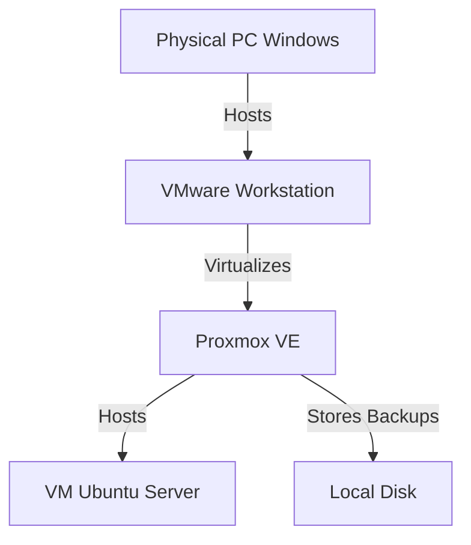

#  VM Backup and Restoration on Proxmox VE (Disaster Recovery)

**Project**: Implementation of a Business Continuity Plan (BCP) and Disaster Recovery Plan (DRP) in a nested virtualized environment.

##  Overview

This project demonstrates the implementation of a resilient infrastructure using Proxmox Virtual Environment (VE). The objective is to master the two pillars of data protection:

- **Snapshots**: For quick versioning and testing
- **Backups**: For protection against total data loss

The project was carried out in a **Nested Virtualization** environment, simulating a real datacenter from a standard workstation.

##  Lab Architecture

The infrastructure is based on a layered architecture:

- **Physical Host**: Windows 11 PC (Wi-Fi/Ethernet Network)
- **Level 1 Hypervisor**: VMware Workstation Pro/Player (NAT/Bridge Configuration)
- **Level 2 Hypervisor**: Proxmox VE 8.x (Static IP)
- **Target VM (Victim)**: Ubuntu Server 24.04 LTS

```mermaid
graph TD;
    A[Physical PC Windows] -->|Hosts| B[VMware Workstation];
    B -->|Virtualizes| C[Proxmox VE];
    C -->|Hosts| D[VM Ubuntu Server];
    C -->|Stores Backups| E[Local Disk];
```

## ⚙️ Prerequisites & Configuration

To allow Proxmox to run within VMware, specific configuration was required:

- Enable nested virtualization (Virtualize Intel VT-x/EPT or AMD-V/RVI)
- Adapted network configuration (Bridge or NAT) for Proxmox internet access

## VM UBUNTU installation

## test file 

##  Part 1: Snapshots (Short-term Protection)

**Scenario**: Critical system modification (Simulating human error)

1. Creation of a critical file on the Ubuntu VM (`important_data.txt`)
2. Taking a snapshot named "Stable-State"
3. **Incident**: Accidental deletion of the file using the `rm` command
4. **Resolution**: Rollback via Proxmox

| Action | Result |
|--------|--------|
| Snapshot Taken | 🟢 Success (State frozen) |
| File Deletion | 🔴 File lost |
| Rollback | 🟢 System restored in < 10s |

File deletion : 

ROllback : 

After the RollbACK : 

##  Part 2: Backups (Long-term Protection)

**Scenario**: Total server crash or VM deletion (Disaster Recovery)

1. Backup storage configuration (`vzdump` on local)
2. Full backup execution (Snapshot Mode, ZSTD Compression)
3. **Major Incident**: Complete deletion of VM 100 (Simulating disk crash)
4. **Resolution**: Complete restoration from backup archive

### Technical Comparison

| Feature | Snapshot 📸 | Backup 💾 |
|---------|------------|-----------|
| Storage | Differential (on VM disk) | Compressed archive `.vma.zst` (Independent) |
| Independence | Depends on original disk | Autonomous (can be moved) |
| Use Case | Before update / Testing | Disaster / Archiving / Ransomware |

 backup log :  

 deleting the VM : 

 VM restored via backup 

##  Automation

To guarantee the RPO (Recovery Point Objective) rule, a scheduled task was created:

- **Frequency**: Every 30 minutes (for testing)
- **Retention**: Keep only the last 2 copies (to save space)
- 
 schedule backup every 30 min : 

##  Conclusion

This project validated:

- The feasibility of nested virtualization for complex labs
- The reliability of Proxmox's snapshot mechanism (based on QCOW2/LVM)
- The robustness of `vzdump` full backups for disaster recovery

### Possible Future Improvements

- Implementation of Proxmox Backup Server (PBS) for deduplication
- Sending backups to external NAS or Cloud (3-2-1 Rule)

